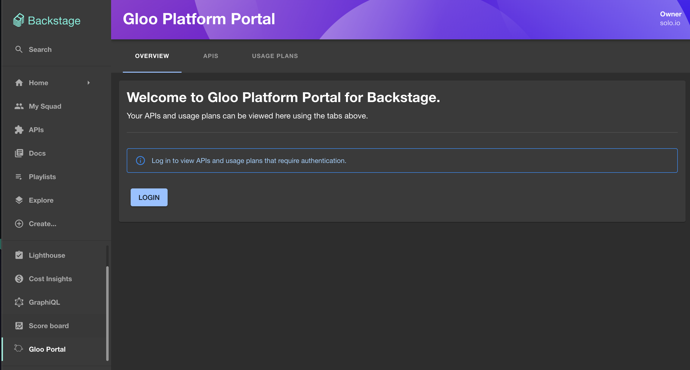
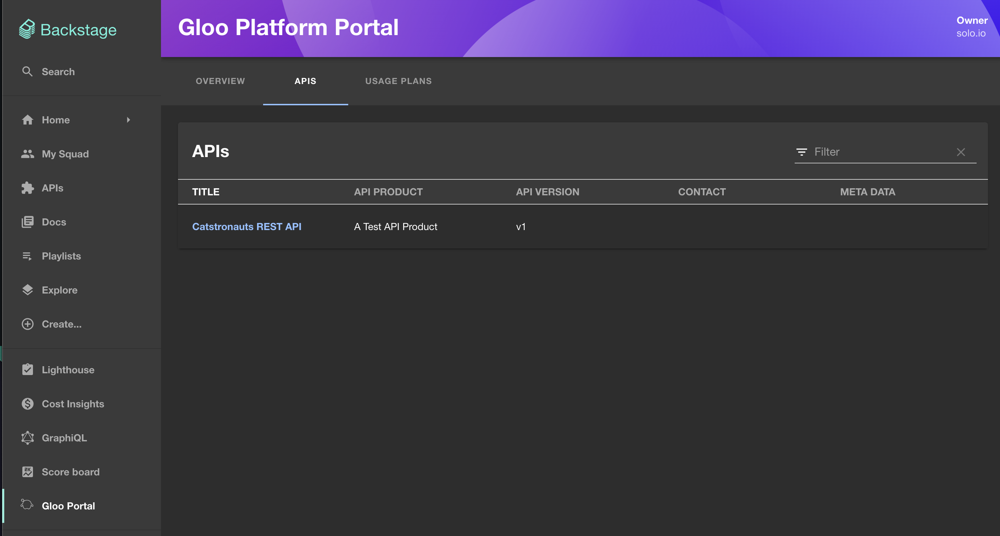
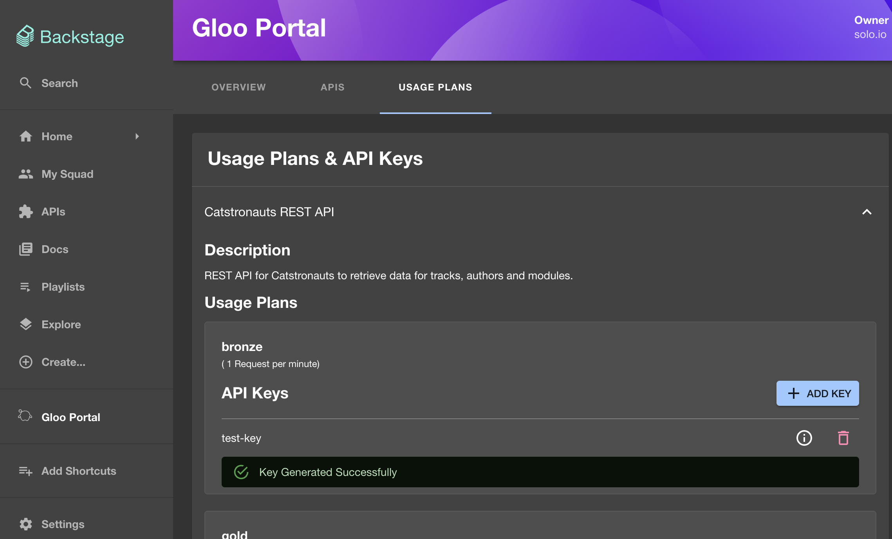
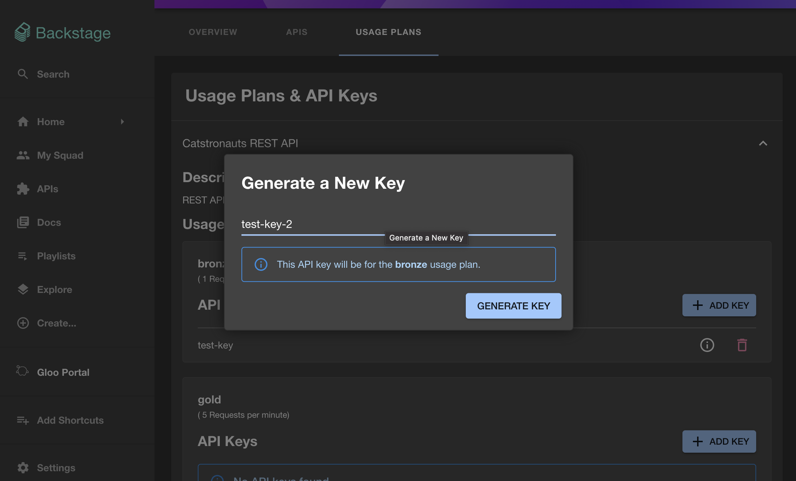

# @solo.io/platform-portal-backstage-plugin-frontend

As a part of [Gloo Platform](https://www.solo.io/products/gloo-platform/), [Gloo Platform Portal](https://www.solo.io/products/gloo-portal/) provides a Kubernetes-native framework for managing the definitions of APIs, API client identity, and API policies that enables GitOps and CI/CD workflows. The portal abstracts the complexity and enables developers to publish, document, share, discover, and use APIs.

The Gloo Platform Portal Backstage plugin provides an interface for teams to manage, secure, and share APIs. This functionality is enabled through Gloo Platform Portal's built in REST API, and configurable ext-auth policies.

[See a demo of Gloo Platform Portal in action here](https://www.youtube.com/watch?v=YL1aqjZDqGQ&t=0)

## Features

- View OpenAPI docs for your Gloo Platform Portal APIs using Swagger UI and Redoc UI.
- View details about your Gloo Platform Portal API usage plans.
- View, create, and delete API keys for any of your usage plans.

## Setup

1. Install the [Gloo Platform Portal Backstage plugin](https://www.npmjs.com/package/@solo.io/platform-portal-backstage-plugin-frontend) into your Backstage app:

```bash
yarn add --cwd ./packages/app @solo.io/platform-portal-backstage-plugin-frontend
```

2. In `./packages/app/src/App.tsx`, add these imports at the top of the file:

```tsx
import {
  GlooPortalHomePage,
  GlooPortalApiDetailsPage,
} from '@solo.io/platform-portal-backstage-plugin-frontend';
```

Then add these routes to the `<FlatRoutes/>` element in that file:

```tsx
<Route path="/gloo-platform-portal" element={<GlooPortalHomePage />} />
<Route path="/gloo-platform-portal/apis" element={<GlooPortalHomePage />} />
<Route path="/gloo-platform-portal/usage-plans" element={<GlooPortalHomePage />} />
<Route
  path="/gloo-platform-portal/apis/:apiId"
  element={<GlooPortalApiDetailsPage />}
/>
```

3. In `./packages/app/src/components/Root/Root.tsx`, add these imports to the top of the file:

```tsx
import { GlooIcon } from '@solo.io/platform-portal-backstage-plugin-frontend';
```

Then add this to the `<SidebarScrollWrapper/>` element in that file.

```tsx
<SidebarItem icon={GlooIcon} to="gloo-platform-portal" text="Gloo Portal" />
```

4. Set the following variables in your `app-config.local.yaml` file to match your Gloo Platform Portal and Keycloak setup before running Backstage:

```yaml
glooPlatformPortal:
  # The URL of the Gloo Platform Portal REST server.
  # The value of this variable should be: <portal-server-url>/v1
  # The default value is: "http://localhost:31080/v1".
  portalServerUrl: 'http://localhost:31080/v1'

  # The oauth client id.
  # In keycloak, this is shown in the client settings
  # of your keycloak instances UI.
  clientId: ''

  # This is the endpoint to get the oauth token.
  # In keycloak, this is the `token_endpoint` property from:
  # <your-keycloak-url>/realms/<your-realm>/.well-known/openid-configuration
  tokenEndpoint: ''

  # This is the endpoint to get PKCE authorization code.
  # In keycloak, this is the `authorization_endpoint` property from:
  # <your-keycloak-url>/realms/<your-realm>/.well-known/openid-configuration
  authEndpoint: ''

  # This is the endpoint to end your session.
  # In keycloak, this is the `end_session_endpoint` property from:
  # <your-keycloak-url>/realms/<your-realm>/.well-known/openid-configuration
  logoutEndpoint: ''
```

## Screenshots

Logged out view:



Logged in view:


Viewing a list of APIs:



Viewing an API using an OpenAPI schema viewer:


Viewing API usage plans:



Generating a new API key under a usage plan:



## Demo Image

Solo.io provides a demo Backstage image with the `@solo.io/platform-portal-backstage-plugin-frontend` package installed. It contains an `app-config.yaml` file which can be configured using Docker environment variables.

To begin the demo, make sure that:

- You can access the portal server and view the Gloo Platform APIs you have access to through a URL that Docker can access (like [http://localhost:31080/v1/apis](http://localhost:31080/v1/apis))
- You have an authorization server (like Keycloak or Okta) running that Docker can access.

Then run a Postgres container for the Backstage catalog (this creates an example user for the demo):

```sh
docker run \
--name backstage-postgres \
-e POSTGRES_USER=postgres \
-e POSTGRES_PASSWORD=password \
-it -p 5432:5432 \
-d postgres:bookworm &
```

Then run the Backstage example app, replacing any environment variables as-needed. This example uses gcr.io/solo-public/docs/portal-backstage-frontend:latest, but you can check the GitHub release versions [here](https://github.com/solo-io/platform-portal-backstage-plugin-frontend/releases). `host.docker.internal`.

```sh
docker run \
--name backstage \
-e PORTAL_SERVER_URL=http://localhost:31080/v1  # replace \
-e CLIENT_ID= # replace \
-e TOKEN_ENDPOINT=.../realms/master/protocol/openid-connect/token # replace \
-e AUTH_ENDPOINT=.../realms/master/protocol/openid-connect/auth # replace \
-e LOGOUT_ENDPOINT=.../realms/master/protocol/openid-connect/logout # replace \
-e POSTGRES_USER=postgres \
-e POSTGRES_PASSWORD=password \
-e POSTGRES_HOST=host.docker.internal \
-it -p 7007:7007 gcr.io/solo-public/docs/portal-backstage-frontend:latest
```

Here is the list of Docker environment variables that this package adds to the Backstage `app-config.yaml`.

```yaml
backend:
  database:
    client: pg
    connection:
      host: ${POSTGRES_HOST}
      port: ${POSTGRES_PORT}
      user: ${POSTGRES_USER}
      password: ${POSTGRES_PASSWORD}
glooPlatformPortal:
  portalServerUrl: ${PORTAL_SERVER_URL}
  clientId: ${CLIENT_ID}
  tokenEndpoint: ${TOKEN_ENDPOINT}
  authEndpoint: ${AUTH_ENDPOINT}
  logoutEndpoint: ${LOGOUT_ENDPOINT}
```
