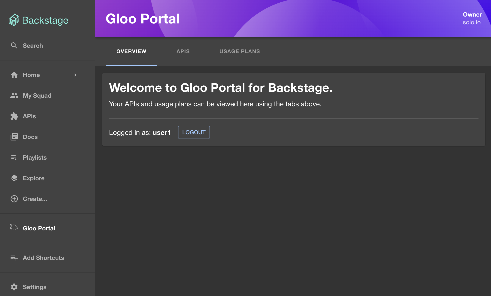

# @solo.io/platform-portal-backstage-plugin-frontend

As a part of [Gloo Platform](https://www.solo.io/products/gloo-platform/), [Gloo Platform Portal](https://www.solo.io/products/gloo-portal/) provides a Kubernetes-native framework for managing the definitions of APIs, API client identity, and API policies that enables GitOps and CI/CD workflows. The portal abstracts the complexity and enables developers to publish, document, share, discover, and use APIs.

The Gloo Platform Portal Backstage plugin provides an interface for teams to manage, secure, and share APIs. This functionality is enabled through Gloo Platform Portal's built-in REST API and configurable usage plans via rate limiting and external auth policies.

For a demo of Gloo Platform Portal, [check out this video](https://www.youtube.com/watch?v=YL1aqjZDqGQ&t=0).

> &#x26a0;&#xfe0f; Projects that use an older version of Backstage (prior to `v1.27.0`) can use [@solo.io/platform-portal-backstage-plugin-frontend@0.0.8](https://www.npmjs.com/package/@solo.io/platform-portal-backstage-plugin-backend/v/0.0.8), since that uses an older version of React.

## Features

- View OpenAPI docs for your Gloo Platform Portal APIs using Swagger UI and Redoc UI.
- View details about your Gloo Platform Portal API usage plans.
- View, create, and delete API keys for any of your usage plans.

## Setup

To set up Gloo Platform Portal resources, view the [**Portal** section in the Gloo Gateway docs](https://docs.solo.io/gloo-gateway/main/portal/).

The [Backstage frontend plugin guide](https://docs.solo.io/gloo-gateway/main/portal/dev-portal/frontend/backstage/) includes detailed setup information for testing locally or deploying the plugin as part of a Backstage app to your cluster.

The following sections provide quick steps for testing this plugin.

### Add the plugin to your Backstage app

1. Install the [Gloo Platform Portal Backstage plugin](https://www.npmjs.com/package/@solo.io/platform-portal-backstage-plugin-frontend) into your Backstage app:

   ```bash
   yarn add --cwd ./packages/app @solo.io/platform-portal-backstage-plugin-frontend
   ```

2. In `./packages/app/src/App.tsx`, add these imports at the top of the file:

   ```tsx
   import {
     GlooPortalHomePage,
     GlooPortalApiDetailsPage,
   } from '@solo.io/platform-portal-backstage-plugin-frontend';
   ```

   Then add these routes to the `<FlatRoutes/>` element in that file:

   ```tsx
   <Route path="/gloo-platform-portal" element={<GlooPortalHomePage />} />
   <Route path="/gloo-platform-portal/apis" element={<GlooPortalHomePage />} />
   <Route path="/gloo-platform-portal/usage-plans" element={<GlooPortalHomePage />} />
   <Route
     path="/gloo-platform-portal/apis/:apiId"
     element={<GlooPortalApiDetailsPage />}
   />
   ```

3. In `./packages/app/src/components/Root/Root.tsx`, add these imports to the top of the file:

   ```tsx
   import { GlooIcon } from '@solo.io/platform-portal-backstage-plugin-frontend';
   ```

   Then add this to the `<SidebarScrollWrapper/>` element in that file.

   ```tsx
   <SidebarItem icon={GlooIcon} to="gloo-platform-portal" text="Gloo Portal" />
   ```

4. Set the following variables in your `app-config.local.yaml` file to match your Gloo Platform Portal and your OAuth provider setup before running Backstage:

   ```yaml
   glooPlatformPortal:
     # The URL of the Gloo Platform Portal REST server.
     # This URL matches the host in the route table for the gloo-mesh-portal-server.
     # Format this variable as: "<portal-server-url>/v1".
     # The default value is: "http://localhost:31080/v1".
     portalServerUrl: 'http://localhost:31080/v1'

     # The OAuth identity provider's Client ID.
     # In Keycloak, open the $KEYCLOAK_URL UI, click Clients, and from the Settings tab, find the Client ID.
     # In Okta, open your $OKTA_URL and from the Applications section, find your app's Client ID.
     clientId: ''

     #
     # In Okta or Keycloak, you can find the following endpoints
     # the well-known OpenID config path for your authorization server, such as:
     # $KEYCLOAK_URL/auth/realms/<your-realm>/.well-known/openid-configuration
     # $OKTA_URL/oauth2/default/.well-known/openid-configuration
     #
     # The `token_endpoint` is where to get the OAuth token.
     tokenEndpoint: ''

     # The `authorization_endpoint` is where to get the PKCE authorization code.
     authEndpoint: ''

     # The `end_session_endpoint` is where to end the session.
     logoutEndpoint: ''

     # This is an optional URL for your Swagger configuration file.
     # The URL can be an absolute or relative path, and can be a JSON or YAML file.
     # If you would like to configure the Swagger UI using the [Swagger UI configuration options](https://swagger.io/docs/open-source-tools/swagger-ui/usage/configuration/), you can do this by:
     #   1. setting this variable to `"/swagger-config.yaml"`,
     #   2. editing the `/packages/app/public/swagger-config.yaml` file,
     #   3. verifying your changes locally,
     #   4. rebuilding the project.
     swaggerConfigUrl: ''
   ```

> &#x26a0;&#xfe0f; For Keycloak users, make sure the OIDC type is set to "public access type" on your client's settings page. On newer Keycloak versions, this is done by unchecking the "Client authentication" checkbox. Older Keycloak versions have an "Access Type" dropdown that should be set to public access.

### Trying out Solo's demo Backstage image

Instead of adding the plugin to your own Backstage app, you can try out Solo's demo Backstage image. This image already has the `@solo.io/platform-portal-backstage-plugin-frontend` package installed. The image contains an `app-config.yaml` file that you can configure by using Docker environment variables.

Before you begin, make sure that:

- You can access the portal server and view the Gloo Platform APIs you have access to through a URL that Docker can access (like [http://localhost:31080/v1/apis](http://localhost:31080/v1/apis))
- You have an authorization server (like Keycloak or Okta) running that Docker can access, with the PKCE authorization flow enabled.

Run Docker containers to demo the Backstage image locally.

1. Run a Postgres container for the Backstage catalog. The following example command creates a user for the demo.

   ```sh
   docker run \
   --name backstage-postgres \
   -e POSTGRES_USER=postgres \
   -e POSTGRES_PASSWORD=password \
   -it -p 5432:5432 \
   -d postgres:bookworm &
   ```

2. Run Solo's demo Backstage app, replacing any environment variables as needed. This example uses the `gcr.io/solo-public/docs/portal-backstage-frontend:latest` image. For other versions, check the [GitHub release versions](https://github.com/solo-io/platform-portal-backstage-plugin-frontend/releases).

> &#x26a0;&#xfe0f; For an older version of Backstage (prior to `v1.27.0`), you can use `gcr.io/solo-public/docs/portal-backstage-frontend:legacy-backstage-backend`.

> &#x24D8; The `PORTAL_SERVER_URL` uses `"localhost"` since it is used in requests that originate from the browser. The `POSTGRES_HOST` uses `"docker.host.internal"` since it is used in requests that originate from the backend.

```sh
docker run \
--name backstage \
-e PORTAL_SERVER_URL=http://localhost:31080/v1  # replace \
-e CLIENT_ID= # replace \
-e TOKEN_ENDPOINT=.../realms/master/protocol/openid-connect/token # replace \
-e AUTH_ENDPOINT=.../realms/master/protocol/openid-connect/auth # replace \
-e LOGOUT_ENDPOINT=.../realms/master/protocol/openid-connect/logout # replace \
-e POSTGRES_USER=postgres \
-e POSTGRES_PASSWORD=password \
-e POSTGRES_HOST=host.docker.internal \
-it -p 7007:7007 gcr.io/solo-public/docs/portal-backstage-frontend:latest
```

3. Check that the Docker environment variables that you set in the previous command are added to the Backstage `app-config.yaml` file.

   ```yaml
   backend:
     database:
       client: pg
       connection:
         host: ${POSTGRES_HOST}
         port: ${POSTGRES_PORT}
         user: ${POSTGRES_USER}
         password: ${POSTGRES_PASSWORD}
   glooPlatformPortal:
     portalServerUrl: ${PORTAL_SERVER_URL}
     clientId: ${CLIENT_ID}
     tokenEndpoint: ${TOKEN_ENDPOINT}
     authEndpoint: ${AUTH_ENDPOINT}
     logoutEndpoint: ${LOGOUT_ENDPOINT}
   ```

## Screenshots

The following screenshots give you an example of how to use the Gloo Platform Portal plugin for Backstage. For a more detailed user guide, see [the product documentation](https://docs.solo.io/gloo-gateway/main/portal/dev-portal/end-user-guide/).

Open the portal server URL and click the **Gloo Portal** plugin to view the default, logged out view.


Click **Login** to authenticate through the OAuth provider that you set up.



Click the **APIs** tab to viewing a list of APIs.


Click an API to view the OpenAPI schema. You can toggle between Swagger and Redocly layouts.


From the Gloo Portal plugin homepage, click the **Usage Plans** tab to view the usage plans and associated API keys for your APIs.


Click **Add Key** to generate a new API key for a usage plan.


To delete an API key, click the **Trash** icon and then **Delete** to confirm deletion.


